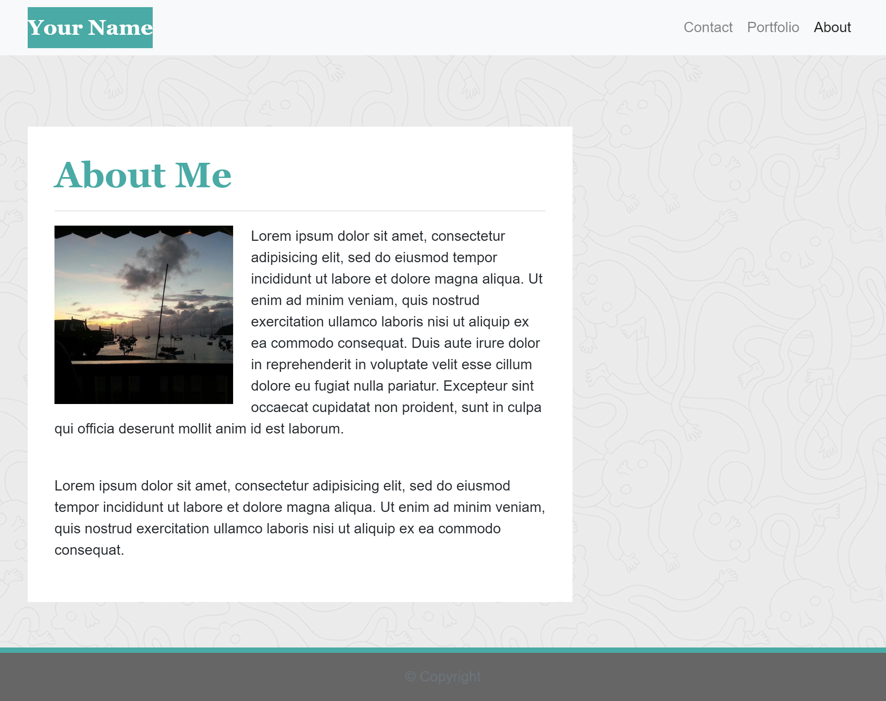

# **Week 2 Assignment. Responsive Portfolio**

## **Description**
### In the second week assignment the students had a task to create a better looking personal website using Bootstrap, Bootstrap's Grid. The following files should be created: index.html, portfolio.html and contact.html.

## The examples of the website are presented below.

## **Credits**
- https://unc.bootcampcontent.com/UNC-Coding-Boot-Camp/unc-ral-fsf-pt-11-2020-u-c/tree/master/02-css-bootstrap/activities/_hw2-starter
- 
- https://freefrontend.com/css-background-patterns/

#### Languages
 

